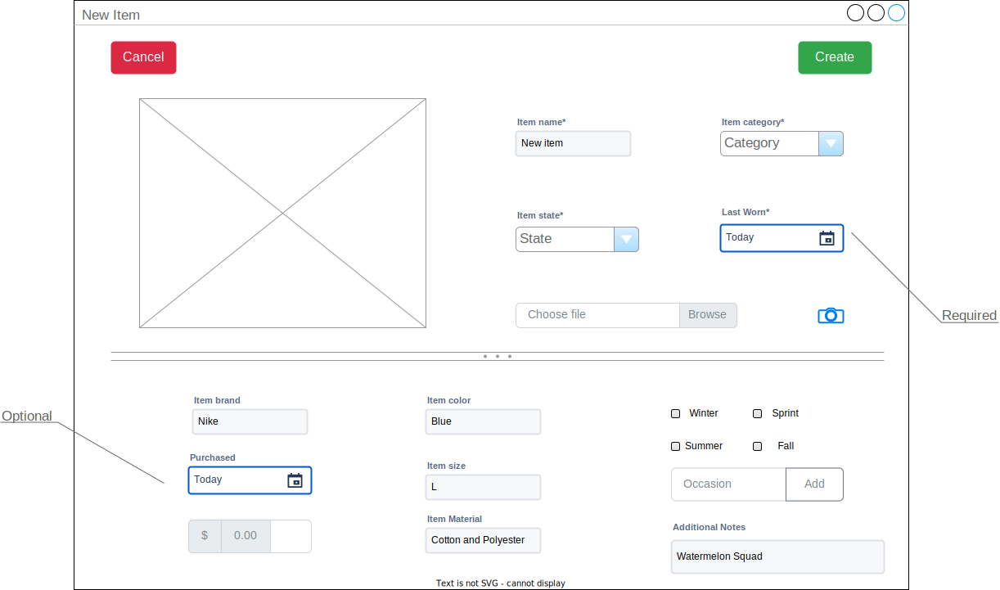

# Clothing item management

## Specification methods

1) **Item name**

- Can be a regular text input field on a form.
- Name uniqueness is dependant on the location of the item in the wardrobe
  - A user can have multiple items with the same name, but they must be in different closet spaces
  - A user cannot have multiple items with the same name in the same closet space
- *Required* for all clothing items

2) **Location**

- Refers to the closet space where the item is stored
- A drop down menu will help ensure clothing items are placed in valid locations
  - Locations are user defined as a closet space
- *Required* for all clothing items

3) **Color**

- Color refinement available through a color picker widget
- **Optional** to provide a color; if not provided, color will not be a searchable attribute
- *Nice to have*: determine the color based on image of clothing 

4) **Brand**

- Simple regular text input field
- Suggest existing brand names if available before creating a new one (with drop down?)
- *Optional* to provide a brand name; absence of brand name will make the brand name not a searchable attribute

5) **Size**

- Drop down menu of sizes defined by the user
- User should just use what is on the item's tag 

6) **Fabric**

- Drop down menu of fabrics defined by the user
- User should just use what is on the item's tag

7) **Purchase date**

- Date picker widget of some sort

8) **Price**

- Text field restricted to valid floating number
- Need to consider localization

9) **Wear frequency**

- A date picker widget of some sort
- *Quality of life*: a "wear today" button of some sort to quickly indicate last worn date is *today*

10) **Image**

- Provided as a image file (obviously)
- *Nice to have*: procedurally generate an image based on other provided attributes
    - Makes image optional, as it would be helpful for visualizing outfits

11) **Clothing state**

- A drop down menu of valid next states
- The current state of the clothing item determines the available next states
- **Required** for all clothing items to determine their availability

12) **Tags**

- A series of two-column text fields
  - Left column: tag key
  - Right column: tag value
- Tags keys are searchable attributes

12) **Coverage**

- A combination of checkboxes that determine the coverage of a clothing item
- Coverage is measured in terms of how an item is worn
  - A hat would have coverage of "head"
  - A shirt would have coverage of "torso"
  - A pair of socks would have coverage of "feet"
  - A ball gown would have coverage of "head" *and* "torso"
- **Required** for all clothing items to cover some part of the body

## Creating a clothing item

### Required information 

- Item name 
- Item placement
- Item last worn date
- Item image
- Item state
- Item coverage

### Additional information

- Item brand
- Item purchase date
- Item price
- Item fabric
- Item size
- Color
- Tags

### Wireframe

## Viewing a clothing item

### Searchability

- By name (default)
- By tags
    - `tagkey:tagvalue` (category:tops)
    - Can be multiple tags listed
    - Any known attribute can be a tag key
    - Tag modifiers
        - is: exact match: `name:is:red shirt` searches for a clothing item that is named "red shirt"
        - like: fuzzy match: `name:like:red` search for clothing items that contain the string "red"
        - not: opposing match: `name:not:like:red` searches for clothing items that **do not** contain the string "red"
        - absence of modifier defaults to fuzzy
- Any attribute explicitly defined in the clothing item record
- Combination can be conjunctive or disjunctive

### Results

- Wardrobe inventory listed alphabetically by name (default view)
- Search bar filters for desired items
- Overview
    - Picture
    - Name
    - Last worn
    - Availability
- Detailed (Overview +)
    - Any other details provided

### Wireframes

## Updating a clothing item

### Quick actions

- Wear today: sets the last worn date to today (only available if status if "Ready")
- Washed today: sets the status of the item to "Ready" (only available is item is awaiting cleaning)

### Revise item record

- Floating action button to edit an existing clothing record from its **detailed view**
- All fields shown, even if not defined
- Image is updated by tapping/clicking on current image

### Wireframes

## Deleting a clothing item

1) Tap/click on the red "delete" button in the **detailed view**
2) Confirm deletion if it is OK to delete (Item cannot be deleted if part of an outfit)

## Clothing item FSM

