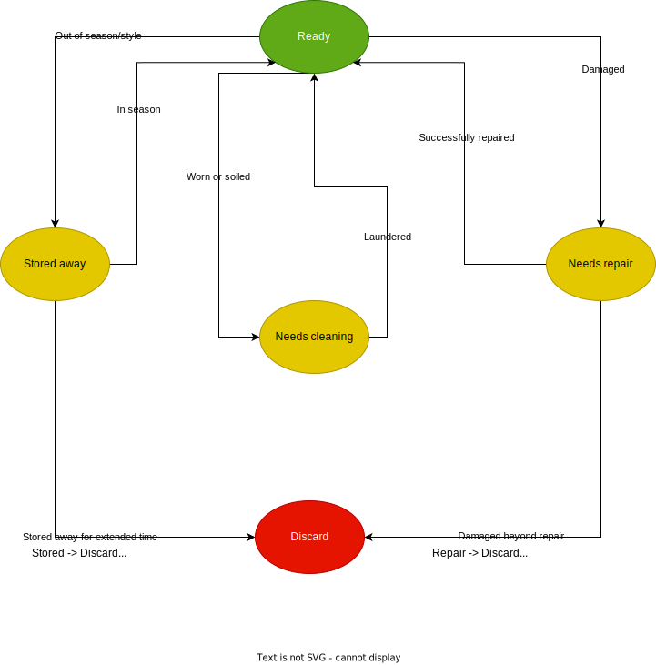

# Clothing item management

## Specification methods

### 1) Item name

- Can be a regular text input field on a form.
- Name uniqueness is not required, but would be nice to show similarly named items if available.
- **Required** for all clothing items

### 2) Category

- Refers to the type of an clothing item
- A dropdown menu will help ensure clothing items are grouped into a finite number of groups
    - Tops
    - Bottoms
    - Dresses
    - Footwear (socks/shoes)
    - Sleepwear
- May want to allow user's to specify their own
    - Can sort be done through the tags/keyword system

### 3) Color

- Dropdown of color presets
- Color refinement available through a color picker widget
- *Nice to have*: determine the color based on image of clothing 

### 4) Brand

- Simple regular text input field
- Suggest existing brand names if available before creating a new one (with dropdown?)

### 5) Size

- Simple text field
- User should just use what is on the item's tag 

### 6) Fabric

- Simple text field
- User should just use what is on the item's tag

### 7) Purchase date

- Date picker widget of some sort

### 8) Price

- Text field restricted to valid floating number
- Need to consider localization

### 9) Wear frequency

- A datepicker widget of some sort
- QoL: a "wear today" button of some sort to quickly indicate last worn date is *today*

### 10) Occasions

- A select all that apply for a clothing item
- May be a section of tags 

### 11) Seasons

- Also select all that apply 
- May be a section of tags

### 12) Image 

- Provided as a image file (obviously)
- *Nice to have*: procedurally generate an image based on other provided attributes
    - Makes image optional, as it would be helpful for visualizing outfits
    
### 13) Notes

- Free form text for any additional user provided information

### 14) Availability

- Dropdown of possible clothing states

## Creating a clothing item

## Viewing a clothing item

## Updating a clothing item

## Deleting a clothing item

## Clothing item FSM

